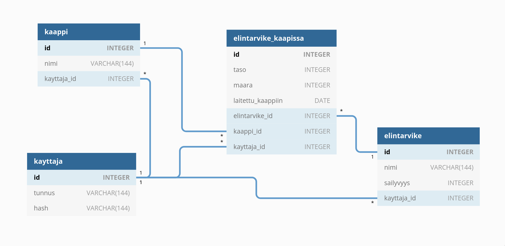

# Tietokanta

## Tietokantakaavio


## SQL-skeema

```
CREATE TABLE kayttaja (
	id INTEGER NOT NULL,
	tunnus VARCHAR(144) NOT NULL,
	hash VARCHAR(144) NOT NULL,
	PRIMARY KEY (id)
);
CREATE TABLE kaappi (
	id INTEGER NOT NULL,
	nimi VARCHAR(144) NOT NULL,
	kayttaja_id INTEGER NOT NULL,
	PRIMARY KEY (id),
	FOREIGN KEY(kayttaja_id) REFERENCES kayttaja (id)
);
CREATE TABLE elintarvike (
	id INTEGER NOT NULL,
	nimi VARCHAR(144) NOT NULL,
	sailyvyys INTEGER NOT NULL,
	kayttaja_id INTEGER NOT NULL,
	PRIMARY KEY (id),
	FOREIGN KEY(kayttaja_id) REFERENCES kayttaja (id)
);
CREATE TABLE elintarvike_kaapissa (
	id INTEGER NOT NULL,
	taso INTEGER NOT NULL,
	maara INTEGER NOT NULL,
	laitettu_kaappiin DATE,
	elintarvike_id INTEGER NOT NULL,
	kaappi_id INTEGER NOT NULL,
	kayttaja_id INTEGER NOT NULL,
	PRIMARY KEY (id),
	FOREIGN KEY(elintarvike_id) REFERENCES elintarvike (id),
	FOREIGN KEY(kaappi_id) REFERENCES kaappi (id),
	FOREIGN KEY(kayttaja_id) REFERENCES kayttaja (id)
);
```
